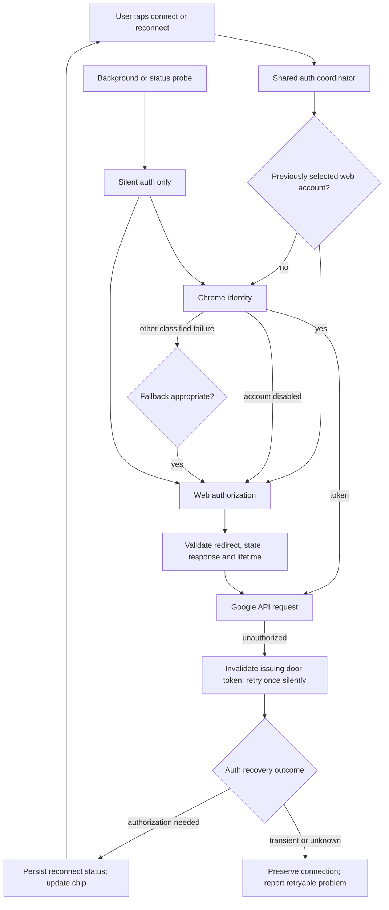

# Phase 1: Stable Extension ID + OAuth Hardening - Research

**Researched:** 2026-09-24
**Domain:** Chrome MV3 extension identity, Google OAuth, reconnect UX
**Confidence:** MEDIUM — current official documentation and current source inspected; external configuration and real accounts not exercised.

<user_constraints>
## User Constraints (from CONTEXT.md)

The following source excerpts are copied verbatim. DATA_f6b03e29_START

### Locked Decisions and Discretion

Gathered in `--auto` mode: Claude selected the recommended option for each gray area below (no user prompts). Decisions and rationale are logged for review.

### Stable extension ID
- **D-01:** Generate an RSA keypair with `openssl`; commit only the public key inside `manifest.json`'s `key` field; keep the private `.pem` out of git (`.gitignore`). Document the one-time manual step of re-pointing BOTH Google OAuth clients — the Chrome-Extension-type client used by `chrome.identity.getAuthToken` and the Web-application client (`WEB_CLIENT_ID` in `lib/google.js`) used by `launchWebAuthFlow` — to the new permanent extension ID, in a short runbook note. — **Reversibility:** costly — **rationale:** once friends have loaded the extension with the new stable ID and Ben has updated both Google Cloud OAuth clients to match, reverting to an unkeyed manifest means every friend's install gets a new random ID again and both OAuth clients need to be repointed a second time.
- **[auto] Stable ID — Q: "Where does the private key live and who updates the OAuth clients?" → Selected: "Generate once, private key out of git, Ben updates both OAuth clients manually via a documented runbook step" (recommended default — this is inherently a manual Google Cloud Console action, not something to automate)**

### 7-day Testing-mode expiry UX
- **D-02:** When both `getChromeToken` and the web-token silent refresh fail with an auth error (not a network error), surface an explicit "Reconnect Google" state on the existing Google chip (`sidepanel/panel.js` ~line 3820, currently shows connected/disconnected) rather than relying on the existing single-retry-then-fail behavior (`lib/google.js` line 134) to surface a raw error to features like outline-doc creation. — **Reversibility:** reversible
- **[auto] Expiry UX — Q: "How should the 7-day Testing-mode lapse surface to the student?" → Selected: "Explicit reconnect state on the existing Google chip, not a raw feature error" (recommended default — avoids a confusing failure inside Smart Start/doc creation when the real cause is an expired grant)**

### Personal-Gmail fallback trigger
- **D-03:** Keep the existing try-chrome-first, fall-back-to-web pattern (`lib/google.js` `getToken()`) rather than proactively detecting "school managed" ahead of time. Add one refinement: when door 1 fails with the specific "Service has been disabled for this account" error (already anticipated in the code's own comments), skip straight to interactive door 2 instead of a doomed retry loop on door 1. — **Reversibility:** reversible
- **[auto] Fallback trigger — Q: "Should the app proactively detect a school-managed account, or keep reacting to door-1 failure?" → Selected: "Keep reacting to door-1 failure; special-case the known 'disabled for this account' error to skip straight to door 2" (recommended default — the existing two-door pattern already works; avoids a rewrite for marginal benefit)**

### OAuth production verification scope
- **D-04:** Do NOT pursue full Google OAuth app verification (multi-week external review) in this phase. Accept the 7-day Testing-mode re-auth as expected pilot behavior for now, made tolerable by D-02's reconnect UX. Revisit verification only if/when distribution grows beyond the personal 5-friend pilot. — **Reversibility:** reversible
- **[auto] Verification scope — Q: "Is full OAuth app verification in scope for this phase?" → Selected: "No — accept 7-day re-auth for the pilot, paired with a clear reconnect UX" (recommended default — verification is disproportionate for a 5-person pilot and already flagged as a later concern in PROJECT.md)**

### Claude's Discretion
- Exact copy/placement of the "Reconnect Google" UI state (chip color, tooltip text, whether a coach-adjacent note fires once) is left to planning/implementation — no specific wording was mandated.
- Whether the manifest-key runbook step lives in a new `docs/` file or an existing one (e.g. `docs/SPEC.md` §13 or a new `RUNBOOK.md`) is left to planning.


### Deferred Ideas (OUT OF SCOPE)

- Full Google OAuth app verification (moving the consent screen to production/"Internal") — explicitly deferred past this pilot milestone (see D-04); revisit if distribution grows.
- Classroom API allow-listing for under-18 accounts — belongs to Phase 2 (Canvas + Google Classroom Read Access), not this phase.

### Reviewed Todos (not folded)
None — `todo.match-phase 1` returned zero matches.


DATA_f6b03e29_END
</user_constraints>

## Project Constraints (from AGENTS.md)

No root AGENTS.md file was found by the session's filesystem probe; the user supplied its instructions directly. Read LEARNINGS.md before work, apply existing successful patterns/preferences, avoid failed patterns, and add only new project-specific observations afterward using date, task type, observation, action and confidence. This research agent owns only this research file; the orchestrator owns any learning update. [VERIFIED: user-supplied AGENTS.md instructions; session filesystem probe]

Preserve the tutor boundary, keep portal credentials in the browser, respect school controls, and never initiate sign-in from background work. Source excerpt DATA_64ae2f01_START: “never bypasses a school control”; “Open a sign-in window on its own from the background.” DATA_64ae2f01_END. [VERIFIED: docs/SPEC.md:17-20,180-182]

Hosting belongs to Phase 1.5 under the September 24 Fly.io decision; older Phase 5 hosting references in the copied context are historical. Do not add hosting, Classroom scopes, consent-screen production migration, portal changes, or a new app/backend/database to this phase. [VERIFIED: .planning/STATE.md:25-39; user task scope]

<phase_requirements>
## Phase Requirements

| ID | Description | Research Support |
|----|-------------|------------------|
| AUTH-01 | A student on a school-managed Chrome account can complete Google sign-in — the personal-Gmail fallback door works when the school blocks third-party OAuth apps | Keep Chrome-first selection, preserve web-account preference, bypass repeated disabled-account attempts only during a user-initiated connection; test a permitted personal account in a real managed profile. |
| AUTH-02 | The extension has a stable ID (manifest `key`), so registered Google OAuth redirect URIs keep working across reinstalls and unpacked reloads | One permanent public key, both Google client registrations, packaged-key preservation and second-path/profile ID check. |
| AUTH-03 | A pilot friend's Google authorization doesn't silently break after 7 days — either the OAuth consent screen moves out of Testing mode, or the re-auth step is documented and expected | D-04 selects Testing; distinguish access-token renewal from grant expiration, expose reconnect, document expected repeat consent. |

Requirement descriptions copied from .planning/REQUIREMENTS.md AUTH section. [VERIFIED: .planning/REQUIREMENTS.md, AUTH section]
</phase_requirements>

## Summary

Use the existing extension and its two OAuth doors. The web door currently requests an implicit access token and renews it by another authorization request using the browser's Google session; it does not exchange a refresh token. Current code excerpt DATA_b03982fd_START: `response_type: "token"`, `prompt: interactive ? "select_account consent" : "none"`, `const WEB_TOKEN_KEY = "googleWebToken";`. DATA_b03982fd_END. [VERIFIED: lib/google.js:48-49,62-95]

Google's Testing policy expires authorization seven days after consent, including refresh tokens if issued; the profile-only exception does not cover this app's Docs/Drive/Calendar scope set. D-04 therefore requires an expected reconnect path, not a fabricated refresh-token fix or an exact seven-day client timer. [CITED: https://support.google.com/cloud/answer/15549945] Current scope excerpt DATA_13f2a4be_START: `"https://www.googleapis.com/auth/documents"`, `"https://www.googleapis.com/auth/drive.file"`, `"https://www.googleapis.com/auth/calendar.events"`. DATA_13f2a4be_END. [VERIFIED: manifest.json:71-78]

**Primary recommendation:** Plan three bounded changes: stable identity plus owner runbook; centralized auth/error/state hardening plus regression tests; existing chip reconnect behavior plus real-browser acceptance. Close missing OAuth state validation within auth hardening. Keep the locked two-door flow; report its legacy implicit-flow limitation without quietly introducing a backend or broad OAuth redesign. [VERIFIED: phase context D-01 through D-04; lib/google.js:62-145]

## Architectural Responsibility Map

Recommended ownership follows the existing identity wrapper, worker opt-out and panel rendering. [VERIFIED: lib/google.js:53-145,177-217; background.js:14-24; sidepanel/panel.js:3891-3921]

| Capability | Primary Tier | Secondary Tier | Rationale |
|------------|-------------|----------------|-----------|
| Stable extension identity | Extension manifest/build | Chrome runtime | The same public key must ship in every pilot package. |
| Token acquisition, renewal and classification | Extension shared Google module | Chrome identity / Google authorization service | One decision path for all Google callers. |
| Reconnect display and explicit user intent | Extension side panel | Shared Google module | UI renders state; only an explicit connection action authorizes visible OAuth. |
| Token cache and selected-door continuity | Extension local storage / Chrome token cache | Shared Google module | Keep account preference separate from a particular invalid token. |
| OAuth registration and test-user access | Google Auth Platform | Project owner | Account configuration outside the repository. |
| Authorization and resource access policy | Google / school administrator | Student's chosen account | Extension must respect denials. |

## Standard Stack

No new external package is needed or recommended. Keep native Chrome APIs, Web Crypto, URL parsing and the existing plain JavaScript module. This is integration hardening, not a scaffold phase. [VERIFIED: lib/google.js:22-145; manifest.json:1-84]

| Component | Version / source | Purpose |
|-----------|------------------|---------|
| Chrome Manifest V3 | Existing `"manifest_version": 3` | Stable public-key identity and existing identity permission. [VERIFIED: manifest.json:2,48-59] |
| Chrome identity API | Current official reference, updated 2026-09-11 | Native cached-token acquisition, invalid-token removal, web auth and redirect construction. [CITED: https://developer.chrome.com/docs/extensions/reference/api/identity] |
| Web platform APIs | Native runtime | Generate random state, parse and validate authorization response; no OAuth library installation. [CITED: https://developers.google.com/identity/protocols/oauth2/javascript-implicit-flow] |
| OpenSSL | Probe returned 3.6.2 | Generate D-01's RSA pair locally; never print or commit the private key. [VERIFIED: session openssl version probe; phase context D-01] |
| Existing Node VM test pattern | Runtime probe v24.19.0 | Execute the real Google module with mocked Chrome and fetch effects. [VERIFIED: session node version probe; scripts/test-background.js:18-70] |

**Installation:** None for OAuth implementation or dependency-free OAuth tests. Restore existing locked development dependencies for DOM smoke tests when needed; do not upgrade test dependencies as part of this phase. See the audit below.

## Package Legitimacy Audit

This audits the existing direct development dependency only, not a new package selection. Lockfile excerpt DATA_ade62b79_START: `"jsdom": "^25.0.0"`; `"version": "25.0.1"`; `"resolved": "https://registry.npmjs.org/jsdom/-/jsdom-25.0.1.tgz"`; `"node": ">=18"`. DATA_ade62b79_END. [VERIFIED: package-lock.json:10-12,516-519,545-547]

The official upstream documents `jsdom` and its `JSDOM` export for DOM testing in Node. Both existing smoke scripts import it directly; the panel smoke script's comment claiming it is not a project dependency is stale relative to the manifest/lockfile. [CITED: https://github.com/jsdom/jsdom] Source excerpt DATA_190ab4ef_START: `const { JSDOM, VirtualConsole } = require("jsdom");`. DATA_190ab4ef_END. [VERIFIED: scripts/smoke-panel.js:2-6; scripts/smoke-toolbar.js:2-8; package.json:12-14]

| Package | Registry / locked version | Age / downloads | Source Repo | Verdict | Disposition |
|---------|---------------------------|-----------------|-------------|---------|-------------|
| `jsdom` | npm / 25.0.1 | Published 2024-09-22; 74,748,020 package downloads/week at lookup | Official [jsdom/jsdom](https://github.com/jsdom/jsdom) | OK for locked 25.0.1 | Restore existing locked dependency; no upgrade or replacement. [VERIFIED: npm registry; version-specific GSD legitimacy check] |

**Registry verification completed:** The parent's successful npm-registry lookup via bundled pnpm returned jsdom 25.0.1, repository `git+https://github.com/jsdom/jsdom.git`, tarball `https://registry.npmjs.org/jsdom/-/jsdom-25.0.1.tgz`, and integrity matching the lockfile byte-for-byte. Lockfile excerpt DATA_6df5a93b_START: `"integrity": "sha512-8i7LzZj7BF8uplX+ZyOlIz86V6TAsSs+np6m1kpW9u0JWi4z/1t+FzcK1aek+ybTnAC4KhBL4uXCNT0wcUIeCw=="`. DATA_6df5a93b_END. [VERIFIED: parent registry tool evidence; package-lock.json:516-519]

**Legitimacy gate resolved:** The first restricted-network run returned null metadata, which was an unavailable observation, not a finding against the package. A network-enabled CLI rerun checked the latest release and returned SUS solely because that unrelated release was two days old. The CLI has no version option, so the researcher invoked its same exported `checkPackages` implementation with `version: "25.0.1"`; it returned OK, the publication timestamp `2024-09-22T05:00:48.869Z`, the official repository and no postinstall script reported. The checked version is the version this phase restores. [VERIFIED: session version-specific GSD package-legitimacy result; npm registry]

**Restore recommendation:** Use `npm ci` with the existing lockfile when npm is available; it performs a frozen dependency-tree installation and fails on manifest/lockfile mismatch rather than selecting fresh versions. [CITED: https://docs.npmjs.com/cli/v11/commands/npm-ci/] For this environment the parent has already authorized a bundled-pnpm fallback: import the existing npm lock, install with `--frozen-lockfile --ignore-scripts`, then remove the temporary pnpm lock. Keep the canonical npm lockfile unchanged and do not substitute an unbounded dependency upgrade. The parent reports the import succeeded; installation completion is separate execution evidence. [VERIFIED: parent execution report and authorization]

**Packages removed as SLOP:** None. **Packages flagged SUS for installation:** None; the locked direct dependency passed the version-specific check. No new installation checkpoint is required by this audit. This is not a claim that all transitive lockfile dependencies were independently audited, or that the package is free of vulnerabilities. [VERIFIED: session version-specific GSD package-legitimacy result]

## Architecture Patterns

### System Architecture Diagram

Proposed flow, constrained by D-01–D-04 and existing worker behavior. [VERIFIED: phase context D-01–D-04; background.js:24]



The diagram does not authorize silent calls to switch to interactive calls. The caller's explicit interaction permission must reach both doors unchanged.

### Current-code evidence and implementation consequences

| Finding | Evidence | Required planning consequence |
|---------|----------|-------------------------------|
| Web callback lacks state construction and validation. | Entire request/callback parsed in lib/google.js:67-94. [VERIFIED: lib/google.js:67-94] | Generate a fresh unpredictable value per attempt, include it in the request and compare it before accepting token or OAuth error. Validate exact expected redirect origin/path too. |
| Web account preference is inferred from possession of a saved token. | Saved token branch and deletion in lib/google.js:99-119. [VERIFIED: lib/google.js:99-119] | Separate “selected web door / previously connected” metadata from token invalidation so a 401 cannot accidentally switch accounts. |
| A mutable module-wide door chooses cache invalidation. | Excerpt DATA_aba0c289_START: `let lastDoor = "chrome";`; `if (lastDoor === "web")`. DATA_aba0c289_END. [VERIFIED: lib/google.js:98,117-120] | Bind issuing-door metadata to the acquired token/request or serialize acquisition; do not let overlapping requests erase the wrong door's cache. |
| Every silent acquisition rejection can trigger interactive acquisition in page contexts. | Catch at lib/google.js:127; interactive default at :124. [VERIFIED: lib/google.js:122-127] | Classify first. Network/unknown/configuration failures must not initiate an account chooser; reconnect should be an explicit chip action. |
| Only the first unauthorized API response causes retry. | Excerpt DATA_1dca3f80_START: `if (res.status === 401 && retry)`; `retry: false`. DATA_1dca3f80_END. [VERIFIED: lib/google.js:133-143] | Keep one retry, mark terminal auth failure centrally, avoid replay loops and repeated popups. |
| Status helpers disagree: account reports any saved token; isConnected tries silent acquisition and discards error identity. | lib/google.js:189-217. [VERIFIED: lib/google.js:189-217] | Expose a shared structured status; retain isConnected boolean compatibility for existing feature gates. |
| The chip renders only at initialization and after clicks. | sidepanel/panel.js:3891-3921,4039. [VERIFIED: sidepanel/panel.js:3891-3921,4039] | Refresh on auth-state changes so failure inside a feature updates the chip immediately; avoid a status probe/storage-write/render loop. |
| Downloading Drive file bytes bypasses the shared API helper. | lib/google.js:443-447. [VERIFIED: lib/google.js:443-447] | Reuse shared auth/error handling while preserving binary arrayBuffer handling; do not make every feature invent reconnect rules. |
| Email lookup is best effort, and manifest scopes are not profile scopes. | lib/google.js:89-94 plus scope excerpt above. [VERIFIED: lib/google.js:89-94; manifest.json:73-77] | Keep email optional. On account switch, do not reuse an old email as proof of the new account identity or add scopes just to decorate the chip. |
| Private PEM exclusion already exists. | Excerpt DATA_28bd119a_START: `*.pem`. DATA_28bd119a_END. [VERIFIED: .gitignore:6-11] | Verify exclusion and packaged artifacts; do not add redundant ignore rules. |

### Error classification and reconnect semantics

The following are proposed implementation rules, not claims that Chrome provides a complete stable error-code taxonomy. Chrome reports runtime errors and whether a prompt is required; Google can return OAuth errors. Preserve both doors' failure causes instead of returning only the final error. [CITED: https://developer.chrome.com/docs/extensions/reference/api/identity] [VERIFIED: lib/google.js:53-59,79-87,106-114]

- Treat an explicit expired/revoked authorization or terminal unauthorized API response after one silent retry as reconnect-worthy for a previously connected account.
- Treat first-run no-grant as disconnected. Treat user cancellation as cancellation, without discarding a working connection.
- Treat fetch rejection/offline/timeouts and server failure as transient. Preserve prior connection metadata; render a retryable message, not an assertion that consent expired.
- Treat invalid client/redirect configuration as setup errors for the owner; repeated student consent cannot repair registration.
- Treat resource permission failure separately. A forbidden response does not by itself prove that the OAuth grant expired.
- Treat unrecognized Chrome messages conservatively as unknown. Do not classify all “OAuth” errors or all failed silent flows as expired authorization.
- D-02's “both doors fail” applies when both doors are eligible. Once a student deliberately selected the web account, failed web renewal must not silently switch to the Chrome school account.
- D-03's disabled-account shortcut applies within a user-initiated connect/reconnect operation. A prior silent disabled-account observation may skip redundant Chrome work on the next tap. A background attempt still stays non-interactive.
- Persist only bounded connection metadata for cross-context UI updates. A reconnect display does not require persisting raw provider errors or callback URLs.

These recommendations address the current catch-all behavior and stale account display directly. [VERIFIED: lib/google.js:98-145,189-217; sidepanel/panel.js:3891-3921]

### Stable identity and owner runbook

Chrome documents that a public key in the manifest preserves extension identity; its public tutorial obtains the key from the developer dashboard. D-01 instead locks local RSA generation. Use a public SubjectPublicKeyInfo representation, base64 DER with no PEM headers/newlines, and prove the actual installed ID in Chrome before changing Google registration. This phase does not need a store upload. [CITED: https://developer.chrome.com/docs/extensions/reference/manifest/key] [VERIFIED: phase context D-01] The precise local OpenSSL command sequence and any independent ID derivation should be validated by the executor against Chrome; do not invent the final key or ID in the plan.

Prepare a concrete runbook with the generated public key, observed permanent ID and actual getRedirectURL result before the owner performs the external step. Chrome's OAuth tutorial calls the client registration field “Item ID”; older context calls it “Application ID.” Register that exact extension ID for the Chrome Extension client. If the console does not permit editing the existing registration, recreate that client and update the manifest client identifier. Do not claim editing is always supported. [CITED: https://developer.chrome.com/docs/extensions/how-to/integrate/oauth]

For the web client, register the exact URI returned by the extension including the trailing slash. Check existing enabled APIs and the intended pilot emails in the Testing audience. Do not store any client secret in the extension. [CITED: https://developers.google.com/identity/protocols/oauth2/javascript-implicit-flow] [CITED: https://support.google.com/cloud/answer/15549945]

The packaging script copies the manifest and rewrites selected permission fields rather than reconstructing the whole object. Source excerpt DATA_dcc7230e_START: `"$ROOT/content.js" "$ROOT/background.js" "$ROOT/manifest.json" "$STAGE/"`; `json.dump(m, open(path, "w"), indent=2)`; `OUT="$DIST/focus-agent-$VERSION$SUFFIX.zip"`. DATA_dcc7230e_END. Verify the generated pilot zip still contains the identical public key and no private key. [VERIFIED: scripts/package-store.sh:27-42,63-69]

### Component Responsibilities

Existing modules are edit targets, not new filesystem-path declarations. [VERIFIED: manifest.json:1-84; lib/google.js:22-217; sidepanel/panel.js:3891-3921; scripts/package-store.sh:25-69]

| Component | Change |
|-----------|--------|
| Manifest | Add one permanent public key; change Chrome client ID only if the owner must replace registration. |
| Shared Google module | Structured auth outcome, door continuity, callback validation, one-retry handling, status notification. |
| Existing side-panel chip | Clear connect/reconnect/connected affordances, optional transient notice, busy guard and accessible label; no new settings system. |
| Existing packaging workflow | Assert key retained and private material excluded. |
| New dependency-free OAuth test script (planner names file) | Execute real module in Node VM, not a copied miniature implementation. |
| New or existing owner-facing runbook (planner chooses location) | Exact registration values, Testing expectations, owner completion checklist, real-browser test record. |

## Don't Hand-Roll

| Problem | Use Instead | Basis |
|---------|-------------|-------|
| Chrome token caching / expiration | Chrome identity cache and removeCachedAuthToken | [CITED: https://developer.chrome.com/docs/extensions/reference/api/identity] |
| Authorization response parsing | Native URL and URLSearchParams, strict validation | [VERIFIED: lib/google.js:67-87] |
| Random OAuth state | Web Crypto random generation | [CITED: https://developers.google.com/identity/protocols/oauth2/javascript-implicit-flow] |
| Refresh-token machinery | Existing silent authorization renewal, explicitly named as such | [VERIFIED: lib/google.js:62-95] |
| Visible Google sign-in UI | Google's account chooser through existing Chrome identity integration | [VERIFIED: lib/google.js:67-83] |

## Runtime State Inventory

This phase changes extension identity, so runtime state must be considered even though it is not a broad refactor. Entries distinguish repository evidence from uninspected external state.

| Category | Items Found / Evidence | Required Action |
|----------|------------------------|-----------------|
| Stored data | Chrome extension-local data and a cached web token are used. Token excerpt above; storage writes at lib/google.js:94. [VERIFIED: lib/google.js:62-95] | Preserve old install until new ID verified; expect new identity to require reconnect. Do not promise old-ID local sessions/settings automatically transfer. Existing profile data was not inspected. [ASSUMED: A1] |
| Live service config | Both OAuth client registrations must match stable identity under D-01; no authenticated Console inspection occurred. [VERIFIED: phase context D-01] | Owner updates/verifies both registrations and test-user audience; code edits cannot migrate Console state. |
| OS-registered state | No OS registration is part of the inspected manifest or packaging code. [VERIFIED: manifest.json:1-84; scripts/package-store.sh:1-72] | No OS mutation planned. Host registrations outside these files were not audited; do not claim a machine-wide absence. |
| Secrets/env vars | Existing PEM ignore excerpt above; D-01 requires one private RSA key. [VERIFIED: .gitignore:6-11; phase context D-01] | Generate/store private key outside distributed files; no Google client secret or Fly.io secret work in this phase. |
| Build artifacts | Pilot zip path is created by the quoted OUT assignment above. [VERIFIED: scripts/package-store.sh:63-69] | Rebuild distribution after key/client changes; replace old pilot package instructions and record the new ID. |

## Common Pitfalls

1. **“Refresh token expired” is an inaccurate diagnosis here.** The saved web object contains access token, expiry and optional email; silent authorization is the renewal mechanism. Test access-token expiry and authorization lapse separately. [VERIFIED: lib/google.js:62-95]
2. **Network outages becoming reconnect prompts.** Current catch-all retry obscures failure category. Preserve status and do not open an interactive window for transient failures. [VERIFIED: lib/google.js:126-145]
3. **Deleting account preference with an invalid token.** Current web-token removal sends the next acquisition back through Chrome. Preserve selected door during recovery and clear it only on explicit disconnect/account change. [VERIFIED: lib/google.js:98-119,199-205]
4. **Permanent connected appearance.** The current account helper returns cached web metadata without checking expiry. Have the chip consume auth status, not raw cache presence. [VERIFIED: lib/google.js:209-217; sidepanel/panel.js:3891-3897]
5. **Personal Gmail presented as a universal school-policy bypass.** Test users may still be restricted by account/service policy. Offer a permitted personal account only; stop and explain policy denial, never advise disabling school controls or promise school documents become accessible to a different account. [CITED: https://support.google.com/cloud/answer/15549945] [VERIFIED: docs/SPEC.md:17-20]
6. **“Reconnect” interpreted as permission to sign in automatically.** Background code explicitly disables interactivity; preserve that invariant even when adding D-03's fast path. [VERIFIED: background.js:24]
7. **Assuming mocks prove real OAuth registration.** Existing tests stub Google and Chrome. Keep real second-profile/machine acceptance distinct from automated regression completion. [VERIFIED: scripts/test-background.js:27-29,47-70; scripts/test-panel-boundary.js:5-16]

## Code Examples

Current implementation excerpt, provided as evidence of what must be hardened rather than a safe completed implementation. DATA_6af80dc1_START
```javascript
response_type: "token",
redirect_uri: redirect,
scope: scopes(),
include_granted_scopes: "true",
prompt: interactive ? "select_account consent" : "none",
```
DATA_6af80dc1_END. [VERIFIED: lib/google.js:70-77]

Implementation algorithm (pseudocode; all new identifiers and outcomes are proposed, not existing repo enums):
```text
Acquire under explicit caller interaction policy.
Remember issuing door with the returned token.
For a new web flow:
  generate fresh random state held only by this attempt
  send state with authorization request
  require expected redirect origin and path
  require exact returned state before accepting either token or OAuth error
  reject malformed/missing token lifetime rather than inventing success
On API unauthorized:
  invalidate this token in its issuing door
  retry acquisition/request once without silently changing account
On terminal classified authorization failure:
  retain prior account/door metadata
  notify shared reconnect status
On transient/unknown failure:
  retain connection metadata and surface retryable failure
```

State and redirect checks follow Google's CSRF guidance and Chrome's redirect API; remaining steps are recommendations derived from the observed recovery bugs. [CITED: https://developers.google.com/identity/protocols/oauth2/javascript-implicit-flow] [CITED: https://developer.chrome.com/docs/extensions/reference/api/identity] [VERIFIED: lib/google.js:98-145]

## Testing Strategy

Nyquist-specific Validation Architecture is intentionally omitted: source excerpt DATA_915db04a_START: `"nyquist_validation": false`. DATA_915db04a_END. That does not remove functional test needs. [VERIFIED: .planning/config.json:20-25]

Add one focused dependency-free script to the existing test command and exercise the real shared Google module in a VM with fake identity callbacks, storage, clock, fetch and Web Crypto. Existing harnesses establish this pattern but stub Google itself. [VERIFIED: scripts/test-background.js:18-70; scripts/test-panel-boundary.js:5-16]

| Requirement | Automated regression cases | External acceptance |
|-------------|----------------------------|---------------------|
| AUTH-01 | Chrome success; disabled Chrome account goes directly to interactive web only on tap; silent calls never open UI; saved web preference remains after 401; user cancellation; concurrent requests invalidate correct token; missing/wrong OAuth state and unexpected redirect rejected before storage/API effects. | Managed profile where personal account use is permitted; select pilot personal Gmail, complete consent, create an outline doc; record policy denial truthfully if blocked. |
| AUTH-02 | Public key parses; pilot package retains it; no PEM/client secret packaged; both client IDs remain correctly wired. | Load same keyed package from another directory/profile or machine; same observed extension ID and redirect; owner verifies Console matches. |
| AUTH-03 | Expired access token silently renews; authorization-required outcome becomes reconnect; network/unknown/config errors do not falsely mark expiry; second 401 terminates; chip changes after feature failure and after restart; successful reconnect clears marker; explicit disconnect stays disconnected. | Remove/revoke app grant or use expired Testing grant, reopen panel, confirm explicit reconnect, then regain API access. Simulated/revoked-grant check is not evidence that seven real days elapsed. |

Recommended full regression commands are the existing test and smoke scripts plus the new OAuth script. Exact current package script excerpt DATA_210f98bc_START:
```json
"test": "python3 scripts/security_tests.py && node scripts/test-panel-boundary.js && node scripts/test-background.js && node scripts/test-docops.js",
"smoke": "node scripts/smoke-panel.js && node scripts/smoke-toolbar.js",
"package:friends": "bash scripts/package-store.sh --friends"
```
DATA_210f98bc_END. [VERIFIED: package.json:6-10]

Do code, tests, keyed package and runbook before an end-of-phase owner checkpoint. Owner Console work and real-account consent remain necessary external steps under D-01; seven-day waiting, production verification, store listing, and Fly.io deployment are not prerequisites to writing/testing this implementation. [VERIFIED: phase context D-01,D-04; .planning/config.json:32; user phase scope]

## State of the Art

| Existing approach | Current documented position | Phase action |
|-------------------|-----------------------------|--------------|
| Direct implicit access-token flow | Google now warns against direct implicit endpoints for modern browser apps and recommends authorization code with PKCE. [CITED: https://developers.google.com/identity/protocols/oauth2/javascript-implicit-flow] | Honor D-03's retained two-door flow; fix state/redirect/error handling, record legacy-flow limitation, do not claim complete OAuth modernization or add a secret/backend. |
| Chrome-managed token cache | Native API handles cache expiration and supports removing invalid tokens. [CITED: https://developer.chrome.com/docs/extensions/reference/api/identity] | Reuse it rather than build a parallel Chrome token cache. |
| Broad “seven-day refresh token” assumption | Google explicitly describes Testing authorization expiry, including but not limited to refresh tokens. [CITED: https://support.google.com/cloud/answer/15549945] | Document repeat consent as pilot behavior and react to actual failures. |

## Security Domain

Security is enabled at level one: excerpt DATA_4a99e2dc_START: `"security_enforcement": true`, `"security_asvs_level": 1`, `"security_block_on": "high"`. DATA_4a99e2dc_END. [VERIFIED: .planning/config.json:48-50]

Use current ASVS 5 category names instead of the older template numbering; OWASP lists V2 Validation and Business Logic, V6 Authentication, V7 Session Management, V8 Authorization, V10 OAuth and OIDC, V11 Cryptography, V12 Secure Communication, V14 Data Protection and V16 Security Logging and Error Handling. [CITED: https://cornucopia.owasp.org/taxonomy/asvs-5.0]

| Applicable category | Phase control |
|---------------------|---------------|
| V2 / V10 | Validate OAuth response, exact state and redirect, token/lifetime shape; no token storage on validation failure. |
| V6 / V7 / V8 | Explicit consent, correct account continuity, bounded recovery, accurate reconnect state, respect resource and school denials. |
| V11 / V12 | Web Crypto nonce; public/private key separation; HTTPS authorization/API endpoints. |
| V14 / V16 | No token, callback fragment, private PEM, or raw sensitive response in logs/UI/coach requests; minimal persisted auth metadata. |

Control assignments are implementation recommendations grounded in the current OAuth boundary and cited category taxonomy; they are not a claim of ASVS certification. [VERIFIED: lib/google.js:62-145; sidepanel/panel.js:3905-3917] [CITED: https://cornucopia.owasp.org/taxonomy/asvs-5.0]

Chrome local storage is exposed to extension content scripts by default, while access levels can be restricted. The current web token is stored there. Do not restrict the entire local store blindly because content scripts also use extension storage; document this inherited boundary and keep raw tokens out of any new status payloads. A token-store migration is not required by these locked decisions. [CITED: https://developer.chrome.com/docs/extensions/reference/api/storage] [VERIFIED: lib/google.js:94; phase context D-01–D-04]

| Threat | STRIDE | Mitigation |
|--------|--------|------------|
| Unbound OAuth callback / wrong redirect | Spoofing | Per-attempt unpredictable state and exact redirect validation. |
| Token disclosure in reconnect metadata/logs | Information disclosure | Store/render only bounded status; redact provider details. |
| Silent account switch after invalidation | Spoofing / privilege confusion | Bind token to issuing door; preserve selected account intent. |
| Repeated prompts or retry storms | Denial of service | One retry; explicit UI authorization; busy guard. |

Threats are phase-specific risk analysis of the read code, not reports of exploited vulnerabilities. [VERIFIED: lib/google.js:62-145]

## Environment Availability

| Dependency | Availability observed | Fallback / execution action |
|------------|-----------------------|-----------------------------|
| Node | v24.19.0 at caller-provided bundled runtime | Put bundled runtime on task PATH if shell node is absent. [VERIFIED: session runtime probe] |
| Python | Python 3.9.6 | Existing security tests/package script use python3. [VERIFIED: session probe; package.json:7; scripts/package-store.sh:33] |
| OpenSSL | 3.6.2 | Available for key creation. [VERIFIED: session probe] |
| Chrome | Application binary present | Browser/account execution not performed by researcher. [VERIFIED: session filesystem probe] |
| Existing DOM smoke dependency | No node_modules/jsdom directory found by probe | Dependency-free OAuth tests can run immediately; full DOM smoke setup uses existing lockfile if needed. No new dependency selection proposed. [VERIFIED: session directory probe; package.json:12-14] |
| Google Console and managed pilot account | Not inspected/authenticated | Owner external checkpoint after concrete code/runbook/package is ready. [ASSUMED: A2] |

## Assumptions Log

| # | Claim | Section | Risk if Wrong |
|---|-------|---------|---------------|
| A1 | Changing to the permanent ID should be treated operationally as a new identity with reconnect and potentially separate local data; actual old-profile state was not examined. | Runtime State Inventory | Existing users could lose access to local sessions/settings if told to remove old install prematurely. Verify with Chrome before removal; no speculative data migration. |
| A2 | Owner access to Google Console and a suitable permitted managed-profile/personal-account pair will be available for external acceptance. | Environment Availability | Code can finish, but AUTH-01/02 live proof remains pending. Confirm at end-of-phase checkpoint. |

## Open Questions (RESOLVED for planning)

**Planning disposition recorded:** All five questions now have an explicit implementation decision or assigned acceptance gate. “Resolved for planning” below means ownership and handling are settled; it does not assert that external evidence has been obtained. [VERIFIED: 01-01-PLAN.md through 01-04-PLAN.md, reviewed this session]

1. **Actual Google registrations — DEFERRED to 01-04 Task 2, blocking owner/live gate.** Which clients are editable, which require replacement, and whether pilot emails are test users remain externally unverified. 01-03 Task 2 prepares exact public values and setup instructions; 01-04 Task 2 assigns Ben both client registrations and audience verification, then requires the executor to apply any returned public client IDs and rerun tests/builds. Missing Console evidence keeps acceptance pending; it does not block code planning. [VERIFIED: 01-03-PLAN.md Task 2; 01-04-PLAN.md Tasks 1-2]
2. **Managed-device policy — DEFERRED to 01-04 Task 2, blocking real-account acceptance.** A permitted managed-profile/personal-account pairing must complete the fallback and owned-document operation. 01-01 Task 2 implements conservative policy handling without claiming universal access. 01-04 Task 2 records denial or unavailable account as pending/failure; mocks and policy bypasses cannot close AUTH-01. The school's actual permission remains unknown until this gate. [VERIFIED: 01-01-PLAN.md Task 2; 01-04-PLAN.md Task 2]
3. **Old install data — RESOLVED for planning by non-destructive handling; retention inventory DEFERRED to 01-04 live gate.** 01-03 Task 2 requires an inventory of old-ID work/settings and preserving the existing installation; 01-04 Tasks 1-2 use a separate test profile and prohibit removing old data. No automatic migration is promised. Whether an actual pilot has data to retain remains pending and must be recorded before any replacement; no destructive migration is authorized by these plans. [VERIFIED: 01-03-PLAN.md Task 2; 01-04-PLAN.md Tasks 1-2]
4. **Real error wording — RESOLVED for planning by conservative classification in 01-01 Tasks 1-2 and 01-02 Task 1; live observations DEFERRED to 01-04 Task 2.** Implement the known disabled-account case and keep unfamiliar/runtime, network, configuration and resource outcomes distinct rather than inventing expired-grant classifications. Tests establish bounded behavior; sanitized actual provider outcomes are captured during live acceptance. Exact future Chrome messages remain unverified and are not a prerequisite to that conservative implementation. [VERIFIED: 01-01-PLAN.md Tasks 1-2; 01-02-PLAN.md Task 1; 01-04-PLAN.md Task 2]
5. **Legacy implicit-flow limitation — RESOLVED for this phase's scope; modernization DEFERRED beyond Phase 1.** D-03 preserves the existing two-door architecture. 01-01 Task 2 retains the implicit web flow while securing callback validation; its threat model explicitly accepts the inherited boundary. 01-03 Task 2 documents the residual implicit-flow/local-store limitations. Do not add a PKCE/backend/client-secret redesign to close this research question. Official modernization guidance remains valid; these plans do not claim to implement it. [VERIFIED: 01-CONTEXT.md D-03; 01-01-PLAN.md Task 2 and threat model; 01-03-PLAN.md Task 2] [CITED: https://developers.google.com/identity/protocols/oauth2/javascript-implicit-flow]

## Sources

Official sources fetched during this session; claims above cite exact pages:
- [Chrome manifest key](https://developer.chrome.com/docs/extensions/reference/manifest/key): permanent identity/public key.
- [Chrome OAuth integration](https://developer.chrome.com/docs/extensions/how-to/integrate/oauth): Chrome Extension client and Item ID.
- [Chrome identity reference](https://developer.chrome.com/docs/extensions/reference/api/identity): caching, interaction flags, redirects, invalidation; page reports updated 2026-09-11.
- [Google client-side OAuth](https://developers.google.com/identity/protocols/oauth2/javascript-implicit-flow): legacy implicit flow, state/CSRF, modern-code-flow warning.
- [Manage App Audience](https://support.google.com/cloud/answer/15549945): Testing expiry, users, account restrictions.
- [Chrome storage reference](https://developer.chrome.com/docs/extensions/reference/api/storage): storage exposure/access control.
- [OWASP ASVS 5 taxonomy](https://cornucopia.owasp.org/taxonomy/asvs-5.0): current category numbering.
- Current repository sources cited inline were opened with line numbers during this session; shell reads substitute for the unavailable dedicated Read tool.

## Metadata

**Provider/confidence provenance:** research-plan chose Context7 for documentation and websearch for ASVS. Context7 MCP and ctx7 CLI were unavailable; official pages were fetched with the available web tool. The classify-confidence seam returned MEDIUM for websearch with official verification. An unrecognized webfetch provider returned LOW, so it was not used to inflate confidence. The existing jsdom lockfile dependency was subsequently audited as described above; no packages were installed.

| Area | Confidence | Reason |
|------|------------|--------|
| Standard stack | MEDIUM | Native stack matches current official references; no package selection required. |
| Architecture | MEDIUM | Source-grounded bounded plan; live identity and Google environment unverified. |
| Pitfalls | MEDIUM | Concrete code defects and official platform semantics; real school policy/error wording unknown. |

**Research date:** 2026-09-24
**Review horizon:** Recheck official OAuth guidance before execution if delayed beyond 30 days; owner configuration must be checked at execution regardless.
**Commit:** Not committed, as requested by the orchestrator.
